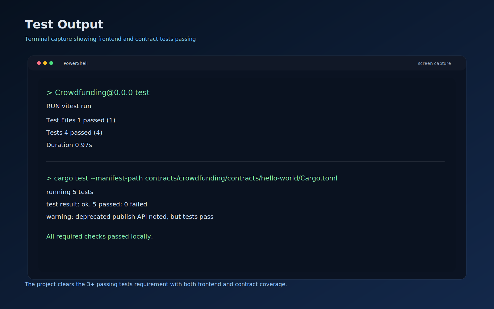

# Stellar Crowdfunding DApp

[](https://crowdfunding-mu-peach.vercel.app/) [](https://github.com/rahuldev8789/Crowdfunding/actions) [](https://crowdfunding-mu-peach.vercel.app/)

## Main Links

- Live Vercel Deployment: https://crowdfunding-mu-peach.vercel.app/
- Demo Video: https://drive.google.com/file/d/1ZTSrL93AISNDjMiIF1L-CjSQ9bmmtSSa/view?usp=sharing
- Public GitHub Repository: https://github.com/rahuldev8789/Crowdfunding
- Contract Explorer: https://stellar.expert/explorer/testnet/contract/CDA2XIUNNPXW3XR2N752LCVATZDG2CQEK2L2LRVKSXRZWHZ4RERYEFOX

## Screenshots

### Mobile Responsive UI


### CI/CD Pipeline Running


### Test Output


## What It Includes

- Wallet connection flow for Freighter and LOBSTR
- Contract donation call flow with Soroban testnet RPC
- Live polling of contract state after actions
- Frontend error handling and loading states
- Contract-side tests for initialize, donate, getters, and funded state
- Frontend helper tests for formatting and contract URL generation
- GitHub Actions CI for lint, build, and contract tests
- Reward-contract calls are wired through `VITE_REWARD_CONTRACT_ID`

## Verification

### Local Checks

- Frontend lint: `npm.cmd run lint`
- Frontend build: `npm.cmd run build`
- Frontend tests: `npm.cmd run test`
- Contract tests: `cargo test --manifest-path contracts/crowdfunding/contracts/hello-world/Cargo.toml`

### Contract Details

- Contract ID: `CDA2XIUNNPXW3XR2N752LCVATZDG2CQEK2L2LRVKSXRZWHZ4RERYEFOX`
- Deployment Transaction: `9ed135ebf1af911d1bdd01887e487d83d4f29e7e9ea80270c6dd9002d00e2ee9`
- Contract Creation Transaction: `e348954ecca4cf5299281c7092bfb18a5dc3d05aeb0572d794ae9ef2aba5dd8f`

## Local Setup

1. Clone the repository
   ```bash
   git clone https://github.com/rahuldev8789/Crowdfunding.git
   cd Crowdfunding
   npm install
   ```

2. Run the development server
   ```bash
   npm run dev
   ```

3. Run frontend tests
   ```bash
   npm run test
   ```

4. Run contract tests
   ```bash
   cargo test --manifest-path contracts/crowdfunding/contracts/hello-world/Cargo.toml
   ```

5. Build for production
   ```bash
   npm run build
   ```
