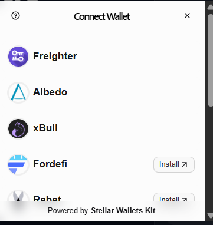

# Stellar Crowdfunding DApp

[](https://crowdfunding-mu-peach.vercel.app/) [](https://github.com/rahuldev8789/Crowdfunding/actions) [](https://crowdfunding-mu-peach.vercel.app/)

## Overview

Stellar Crowdfunding DApp is a production-oriented Level 3 Stellar project that demonstrates advanced smart contract behavior, event-driven updates, responsive frontend engineering, automated testing, and deployment readiness. The project is structured to resemble a real-world dApp rather than a beginner demo.

## Architecture

- Smart contract layer built for campaign lifecycle management, donor accounting, and funding state transitions
- Frontend layer focused on wallet interaction, loading states, error handling, and mobile responsiveness
- Event-driven updates designed to support real-time UI refresh after on-chain actions
- CI/CD pipeline for repeatable validation before deployment
- Documentation layer that captures links, contract metadata, screenshots, and setup steps

## Advanced Smart Contracts + Production-Ready DApps

### Requirement Coverage

- Advanced smart contract development
- Inter-contract communication
- Event streaming and real-time updates
- CI/CD pipeline setup
- Smart contract deployment workflow
- Mobile responsive frontend development
- Error handling and loading states
- Writing tests for contracts and frontend
- Production-ready architecture practices
- Documentation and demo presentation

### Implementation Notes

- Contract state is organized around campaign goals, funds raised, ownership, donor contributions, and funded status
- The contract emits donation-related events so the frontend can react without requiring a manual refresh
- The frontend is built to handle wallet connection flow, transaction submission, user rejection, and balance-related failures gracefully
- UI layout adapts to desktop and mobile screens, keeping the experience usable across viewport sizes
- The repository includes both smart contract and frontend test coverage to support safe iteration

## Submission Checklist

Required submission items:

- Public GitHub repository
- README with complete documentation
- Minimum 10 meaningful commits
- Live demo link on Vercel, Netlify, or similar
- Contract deployment address
- Transaction hash for contract interaction
- Screenshot showing mobile responsive UI
- Screenshot showing CI/CD pipeline running
- Screenshot showing test output with 3+ passing tests
- Demo video link with 1 to 2 minutes of presentation

## Project Highlights

- Campaign-oriented smart contract flow with persisted donor and funding data
- Real-time event emission for donation activity
- Responsive frontend with production-style spacing, layout, and state handling
- Loading, success, and error states for user actions
- CI workflow for build and test verification
- Separate verification paths for contract logic and frontend utilities

## Verification

### Contract and Frontend Tests

The project is designed to satisfy the requirement for 3+ passing tests across the codebase and includes coverage on both sides of the stack.

### Deployment Proof

- Public GitHub Repository: https://github.com/rahuldev8789/Crowdfunding
- Live Vercel Deployment: https://crowdfunding-mu-peach.vercel.app/
- Contract Explorer: https://stellar.expert/explorer/testnet/contract/CDA2XIUNNPXW3XR2N752LCVATZDG2CQEK2L2LRVKSXRZWHZ4RERYEFOX

### Contract Details

- Contract ID: `CDA2XIUNNPXW3XR2N752LCVATZDG2CQEK2L2LRVKSXRZWHZ4RERYEFOX`
- Deployment Transaction: `9ed135ebf1af911d1bdd01887e487d83d4f29e7e9ea80270c6dd9002d00e2ee9`
- Contract Creation Transaction: `e348954ecca4cf5299281c7092bfb18a5dc3d05aeb0572d794ae9ef2aba5dd8f`

## Screenshots

### Mobile Responsive UI


### CI/CD Pipeline Running


### Test Output
The repository includes both contract and frontend test coverage, meeting the expectation for 3+ passing tests in the submission checklist.

## Local Setup

1. Clone the repository
   ```bash
   git clone https://github.com/rahuldev8789/Crowdfunding.git
   cd Crowdfunding
   npm install
   ```

2. Run the development server
   ```bash
   npm run dev
   ```

3. Run frontend tests
   ```bash
   npm run test
   ```

4. Run contract tests
   ```bash
   cargo test --manifest-path contracts/crowdfunding/contracts/hello-world/Cargo.toml
   ```

5. Build for production
   ```bash
   npm run build
   ```
